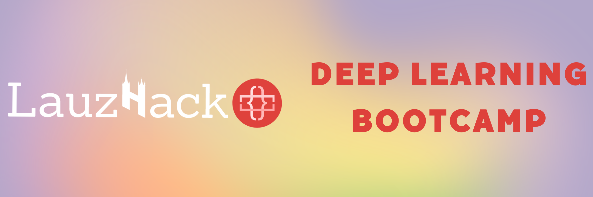

# Deep Learning Bootcamp

Since 2016, LauzHack has organized hackathons at EPFL in Lausanne, Switzerland. We also organize tech talks during the school year. 

This is a repository for our new event: a Deep Learning Summer Bootcamp.

# Syllabus

- [__day01__](./day01) Introduction to Deep Learning and PyTorch
    - Lecture: Introduction to bootcamp and Deep Learning
    - Seminar: Introduction to `pytorch`
    - Lecture 2: Python Dev Tools and Git
- [__day02__](./day02) Basic Model Architectures
    - Lecture: Fully-connected and Convolutional Neural Networks, ResNet
    - Seminar: Models in `pytorch` and training pipeline
    - Lecture 2: Recurrent Neural Networks, BatchNorm, LayerNorm
    - Seminar 2: RNN, LSTM, GRU example
- [__day03__](./day03) Transformer and R&D Coding
    - Lecture: Transformer
    - Seminar: Implementation of Transformer in `pytorch`
    - Seminar 2: `WandB`, experiments configuration and code structure  
- [__day04__](./day04) Computer Vision
    - Lecture: TBD
    - Seminar: TBD
    - Lecture 2: TBD
    - Seminar 2: TBD
- [__day05__](./day05) Deep Learning in Audio
    - Lecture: TBD
    - Seminar: TBD
    - Lecture 2: TBD
    - Seminar 2: TBD
- [__day06__](./day06) Distributed Deep Learning and On-Device Learning
    - Lecture: TBD
    - Seminar: TBD
    - Lecture 2: TBD
    - Seminar 2: TBD
- [__day07__](./day07) Natural Language Processing
    - Lecture: TBD
    - Seminar: TBD
    - Lecture 2: TBD
    - Seminar 2: TBD
- [__day08__](./day08) DeepRL, XAI, and multi-model networks
    - Lecture: TBD
    - Seminar: TBD
    - Lecture 2: TBD
    - Seminar 2: TBD
    - Lecture 3: TBD
    - Seminar 3: TBD
- [__day09__](./day09) Model Fine-tuning
    - Lecture: TBD
    - Seminar: TBD

# Resources

* [Recordings on YouTube](TBA)

# Contributors & bootcamp staff

Bootcamp materials and teaching were delivered by:

- Petr Grinberg
- Seyed Parsa Neshaei
- Eric Bezzam
- Federico Stella
- Atli Kosson
- Cristian Cioflan
- Skander Moalla
- Vinitra Swamy