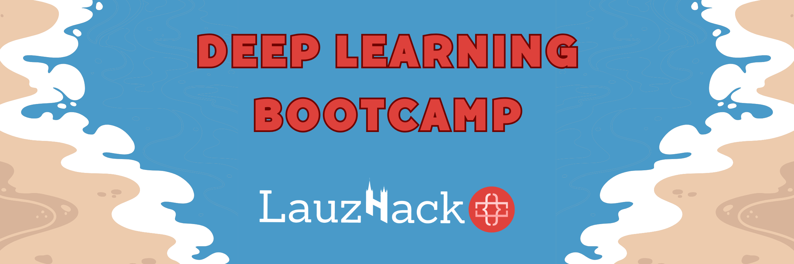

# Deep Learning Bootcamp

Since 2016, LauzHack has organized hackathons at EPFL in Lausanne, Switzerland. We also organize tech talks during the school year.

This is a repository for our Deep Learning Bootcamp (Summer 2025 Edition). For previous editions, see [Previous Editions](#previous-editions) section.

# Syllabus

- [**day01**](./day01) Introduction to Deep Learning and PyTorch
  - Lecture: Introduction to bootcamp and Deep Learning
  - Seminar: Introduction to `pytorch`
- [**day02**](./day02) Basic Model Architectures
  - Lecture: Fully-connected and Convolutional Neural Networks, ResNet
  - Seminar: Models in `pytorch` and training pipeline
- [**day03**](./day03) Recurrent Neural Networks
  - Lecture: Recurrent Neural Networks, LSTM, GRU
  - Seminar: RNN, LSTM, GRU example
- [**day04**](./day04) Transformer and Normalization layers. Introduction to NLP.
  - Lecture: Transformer. BatchNorm, LayerNorm.
  - Seminar: Implementation of Transformer in `pytorch`
- [**day05**](./day05) Creating convenient Deep Learning pipelines and clean reproducible code.
  - Lecture: Logging, Configuration, Reproducibility, and Project-based code development.
- [**day06**](./day06) Large Language Models (LLMs) and Brain-inspired LLMs.
  - Lecture: Introduction to LLMs and how can we improve them through brain-inspiration.

<!--
- [**day07**](./day07) Graph Neural Networks
  - Lecture: Graph learning, applications, limitations
  - Seminar: PyTorch-based examples of training GCN and SAGE architectures
- [**day08**](./day08) Computer Vision
  - Lecture: Diffusion models, Vision Transformers, Object Detection, Generalizability, Test-Time Training
  - Seminar: Diffusion models and test-time training with MNIST -->

# Resources

- [Recordings on YouTube](https://youtube.com/playlist?list=PLpYenI2Zwc7anzzqCBj8KJkyny0xAaUKC)

# Contributors & bootcamp staff

Bootcamp materials and teaching were delivered by:

- Petr Grinberg
- Seyed Parsa Neshaei
- Badr AlKhamissi
- Mingchi (Alina) Hou
- Eric Bezzam (Previously)
- Ali Hariri (Previously)
- Nikita Durasov (Previously)
- Federico Stella (Previously)
- Atli Kosson (Previously)
- Cristian Cioflan (Previously)
- Skander Moalla (Previously)
- Vinitra Swamy (Previously)

# Previous Editions

- [Winter 2025](https://github.com/LauzHack/deep-learning-bootcamp/tree/winter25/)
- [Summer 2024](https://github.com/LauzHack/deep-learning-bootcamp/tree/summer24/)
